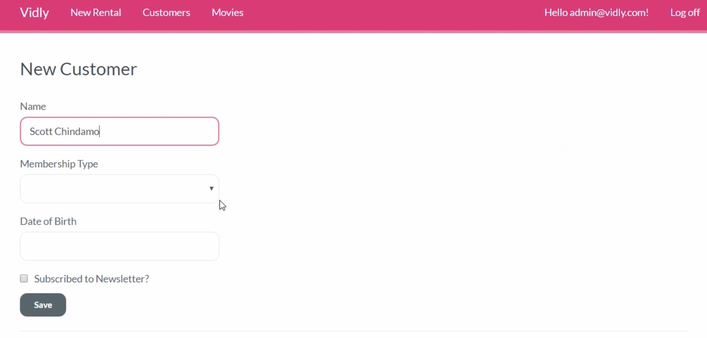
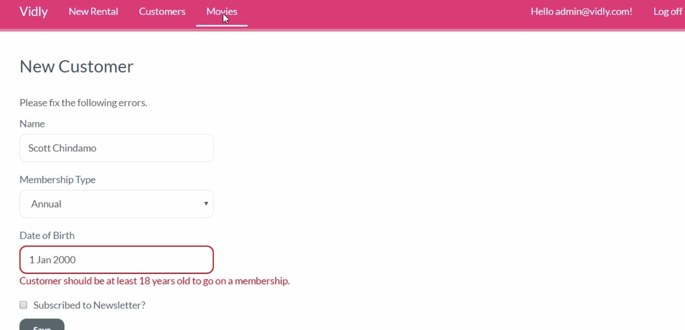
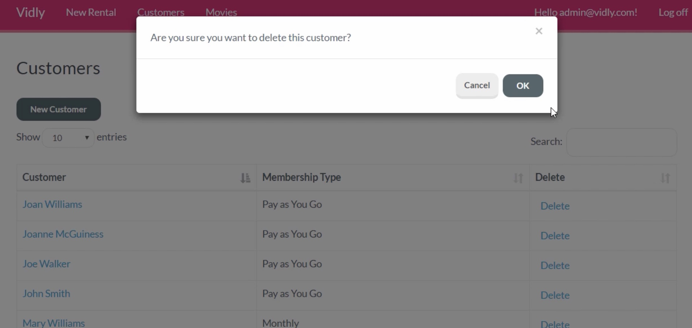
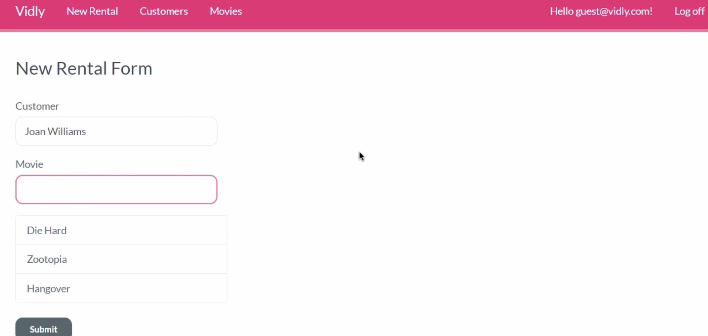

# VidlyMovieStore
This is a fully-functional MVC movie rental store. 
Different useres(admins and clients) with different permissions. 

## Techniques
Front-end: Bootstrap, Bootbox, Datatable, Jquery, Ajax
Database: EntityFramework: Code-first; SQLServer

## Admin login

**Figure 1** -Show all movies.

**Figure 2** -Add new customer.

**Figure 3** -Add new customer.

**Figure 4** -Delete a customer.

## Client login

**Figure 1** -Show all movies.

**Figure 2** -Add a new rental.
